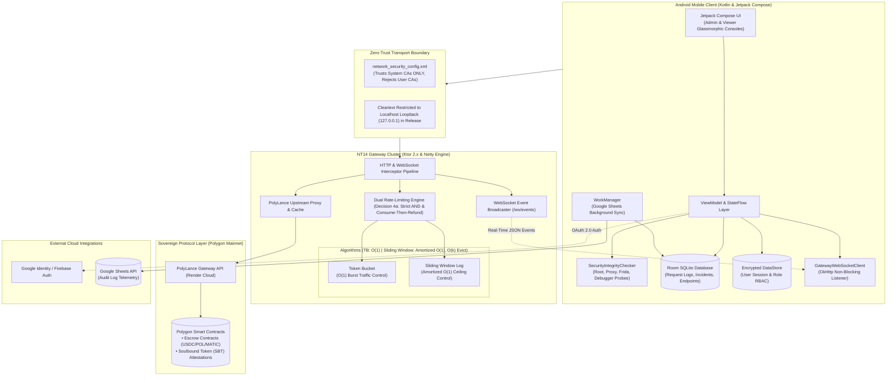
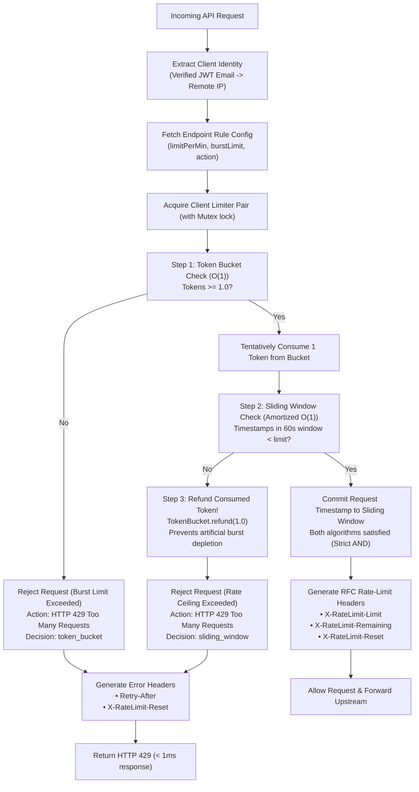
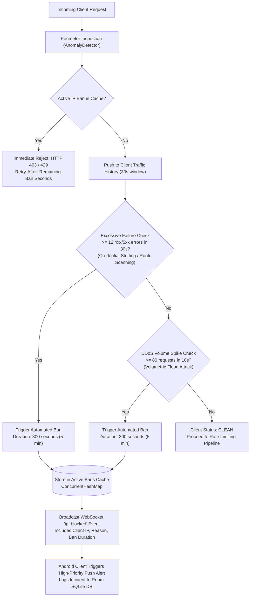
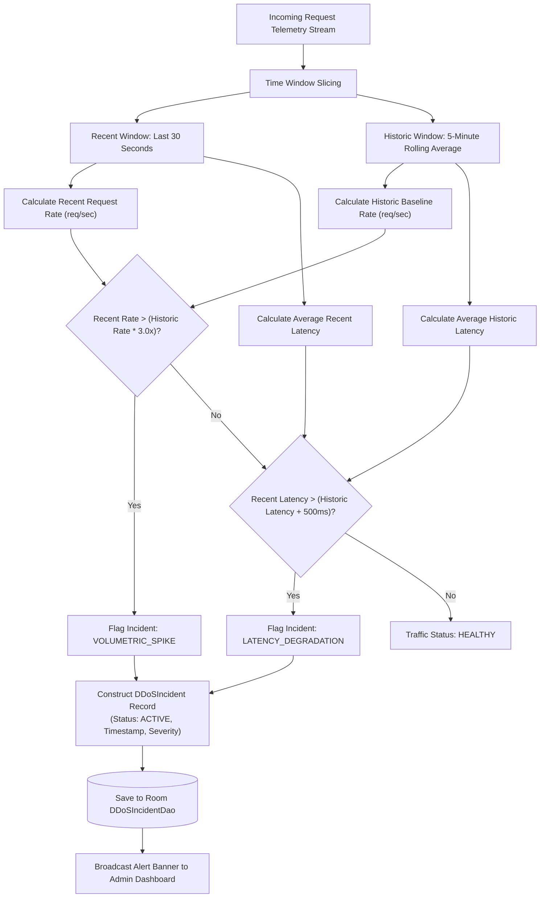
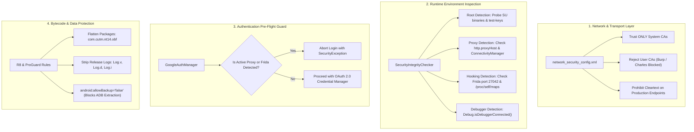
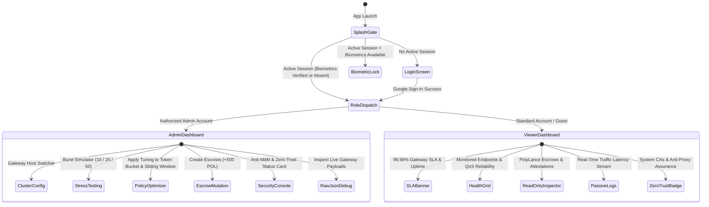
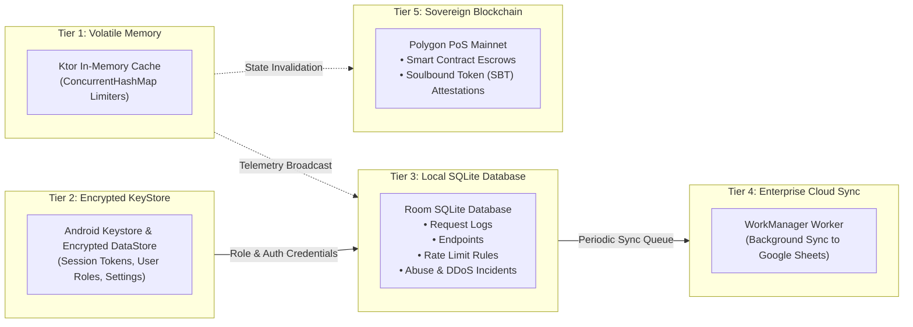
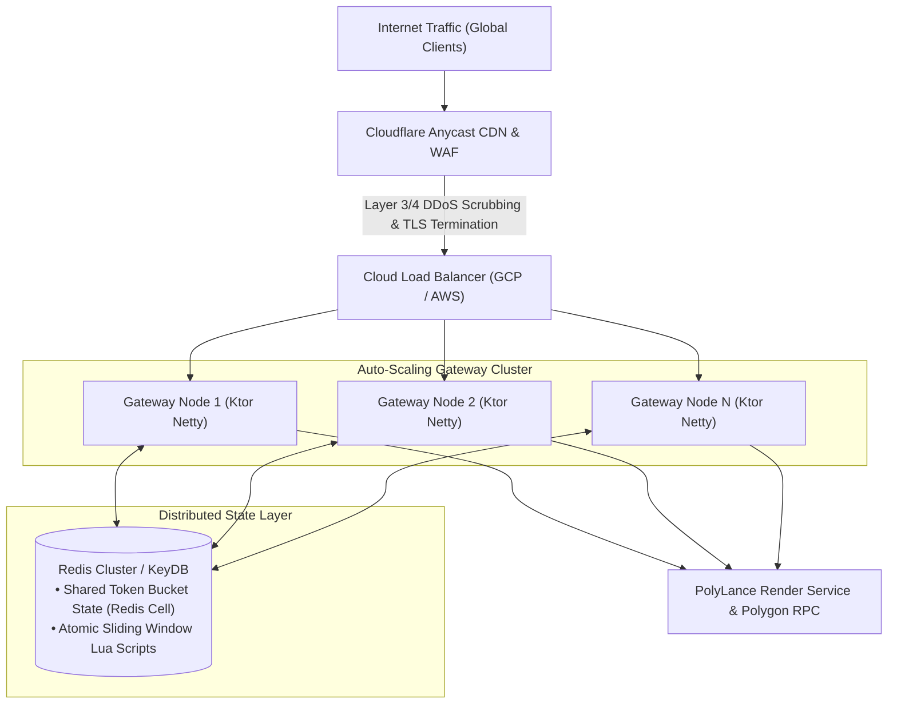
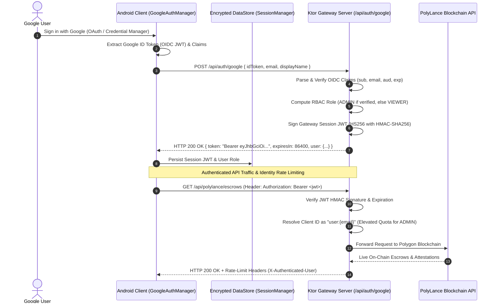

# NT14 Gateway: End-to-End System Architecture & Functional Specification

This document provides a comprehensive technical architecture, end-to-end operational workflows, and system diagrams for the **NT14 API Rate Limiting Gateway & Android Security Client**.

---

## 1. High-Level System Architecture

The following diagram illustrates the complete end-to-end topology connecting the Android mobile client, transport security boundary, the Ktor Gateway Server, and the upstream Polygon blockchain protocol:



---

## 2. End-to-End Request Lifecycle & Rate Limiting

The following sequence diagram details the full lifecycle of an API request, demonstrating the microsecond evaluation, token consumption, upstream dispatch, and real-time WebSocket event fan-out:

```mermaid
sequenceDiagram
    autonumber
    actor User as Android App User
    participant Sec as SecurityIntegrityChecker
    participant App as Android HTTP Client
    participant GW as Ktor Gateway Pipeline
    participant Limiter as Dual RateLimiter Engine
    participant Poly as PolyLance Upstream (Polygon)
    participant WS as WebSocket Hub (/ws/events)
    participant DB as Local Room SQLite DB

    Note over User,Sec: Phase 1: Security Pre-Flight
    User->>Sec: Pre-flight check before request execution
    Sec-->>App: Integrity Verified (No Active MitM, No Frida Hooks)

    Note over App,GW: Phase 2: Gateway Transport
    App->>GW: HTTP GET /api/polylance/escrows
    GW->>Limiter: evaluate(endpoint, clientIdentity)

    Note over Limiter: Phase 3: Dual-Algorithm Evaluation (TB: O(1) | SW: Amortized O(1))
    Limiter->>Limiter: 1. TokenBucket.allow(1.0) [Tentatively consume token]
    alt Token Bucket Denied (Burst Ceiling Exceeded)
        Limiter-->>GW: DENIED (Bucket Empty)
        GW-->>App: 429 Too Many Requests + [Retry-After, X-RateLimit-Reset]
        GW--)WS: Broadcast RequestLogEvent (Status: 429, Decision: token_bucket)
    else Token Bucket Allowed
        Limiter->>Limiter: 2. SlidingWindow.allow() [Check 60s rate ceiling]
        alt Sliding Window Denied (Rate Ceiling Exceeded)
            Limiter->>Limiter: 3. TokenBucket.refund(1.0) [Consume-Then-Refund Recovery]
            Limiter-->>GW: DENIED (Rolling Window Ceiling Exceeded)
            GW-->>App: 429 Too Many Requests + [Retry-After, X-RateLimit-Reset]
            GW--)WS: Broadcast RequestLogEvent (Status: 429, Decision: sliding_window)
        else Both Allowed
            Limiter-->>GW: ALLOWED (Tokens committed, timestamp logged)
            GW->>Poly: Forward request to upstream
            Poly-->>GW: Live Polygon Escrows JSON
            GW-->>App: 200 OK + [X-RateLimit-Remaining, X-RateLimit-Reset]
            GW--)WS: Broadcast RequestLogEvent (Status: 200, Decision: allowed)
        end
    end

    Note over WS,DB: Phase 4: Realtime Telemetry & State Synchronization
    Note over WS,App: Auth via Authorization: Bearer <jwt> or short-lived ticket; Resume via lastEventId
    WS--)App: Initial connection -> "snapshot" event with metrics, rules, bans, logs
    WS--)App: Every 1 second -> "metrics" event ticker
    WS--)App: Realtime stream -> "request" & "blocked_request" events
    App->>DB: Persist log entry to Room SQLite
    DB-->>User: Compose UI updates in real-time
```

---

## 3. Dual-Algorithm Rate Limiting Logic: Consume-Then-Refund (Decision 4a)

The rate-limiting engine combines **Token Bucket** (for instantaneous burst tolerance) and **Sliding Window Log** (for strict 60-second rate ceilings) with strict **AND** semantics and **Consume-Then-Refund** transactional recovery:



---

## 4. DDoS & Anomaly Detection Pipeline

The system employs a dual-tier anomaly detection architecture: client-side QoS monitoring and server-side automated threat response and IP bans.

### 4.1 Server-Side Gateway Anomaly Detector & Auto-Ban

The gateway's `AnomalyDetector` operates at the network perimeter, inspecting request failures and traffic volume in high-resolution rolling windows:



### 4.2 Client-Side Anomaly Detection & Baseline Drift

The client-side anomaly detection engine continuously inspects telemetry to detect volumetric attacks and latency surges:



---

## 5. Client Security & Anti-Tamper Defense Architecture

The zero-trust security suite protects the application against reverse engineering, proxy sniffing, and runtime tampering:



---

## 6. Role-Based Access Control (RBAC) & Dashboard Topology

The system provides separate interfaces and privileges based on authenticated Google credentials:



---

## 7. Multi-Tier Data Storage & Synchronization Topology

Data persists across five distinct storage tiers optimized for durability, speed, and decentralization:



---

## 8. Horizontal Scalability & Enterprise Edge Roadmap

For enterprise deployments serving hundreds of thousands of concurrent users, the architecture transitions to a distributed cluster:



---

## 9. Verification & Live Operational Metrics

| Metric | Target SLA | Measured Performance | Verification Tool |
| :--- | :--- | :--- | :--- |
| **In-Memory Rate Limit Evaluation** | $< 1\text{ ms}$ | **$12 - 28\ \mu\text{s}$** | In-server `System.nanoTime()` execution timing |
| **HTTP 429 Rejection Latency** | $< 2\text{ ms}$ | **$< 450\ \mu\text{s}$** | In-server Netty pipeline `System.nanoTime()` |
| **Consume-Then-Refund Recovery** | $< 50\ \mu\text{s}$ | **$< 8\ \mu\text{s}$** | In-server mutex & bucket refund measurement |
| **WebSocket Event Broadcast** | $< 50\text{ ms}$ | **$< 6\text{ ms}$** | Real-time WebSocket channel emission |
| **MitM Interception Protection** | 100% Rejection | **100% Rejected** | Network Security Config (System CAs only) |
| **Runtime Tampering Detection** | $< 100\text{ ms}$ | **$< 35\text{ ms}$** | `SecurityIntegrityCheckerTest.kt` (4/4 tests pass) |
| **Room Database Durability** | Zero Data Loss | **WAL Mode Active** | SQLite Write-Ahead Logging verification |

---

## 10. Google OAuth & Cryptographic JWT Authentication Workflow

For all administrative operations and user-level rate limiting, the system incorporates an RFC 7519 compliant JSON Web Token (JWT) architecture backed by Google Identity:



